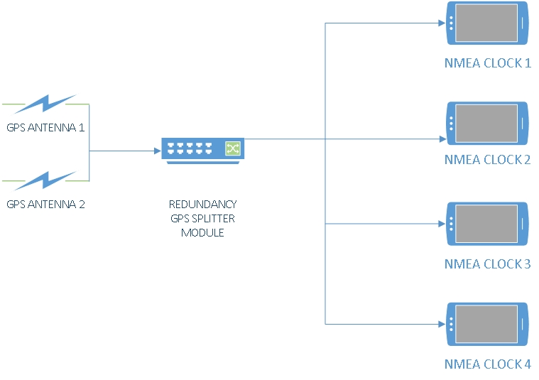
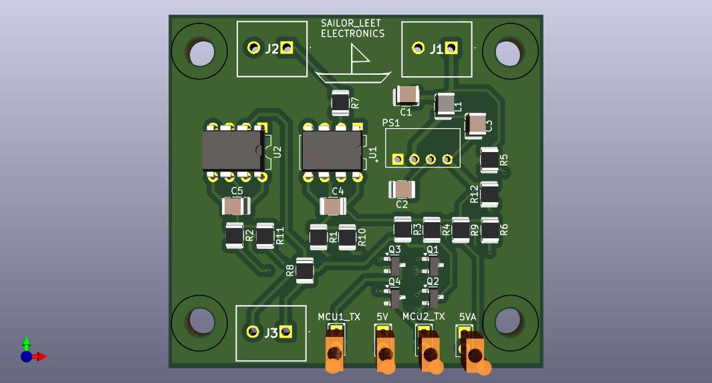

# ESP 32 GPS Tracker with TTL Signal Isolation  

Main purpose of this project is to create Redundant NMEA Distribution System using ESP 32, RS 422 to TTL converter and TTL Signal Isolation board. 

# Components

- 6x ESP32 S3 N16R8 DevKitC-1 16MB Flash 8MB PSRAM 2 x USB C
- 2x GPS GY-NEO6MV2 NEO-6M 
- 4x LCD TFT 2.4 " Touch Display

# General Schematic of the system

# PCB Layout of TTL Signal Isolation board

